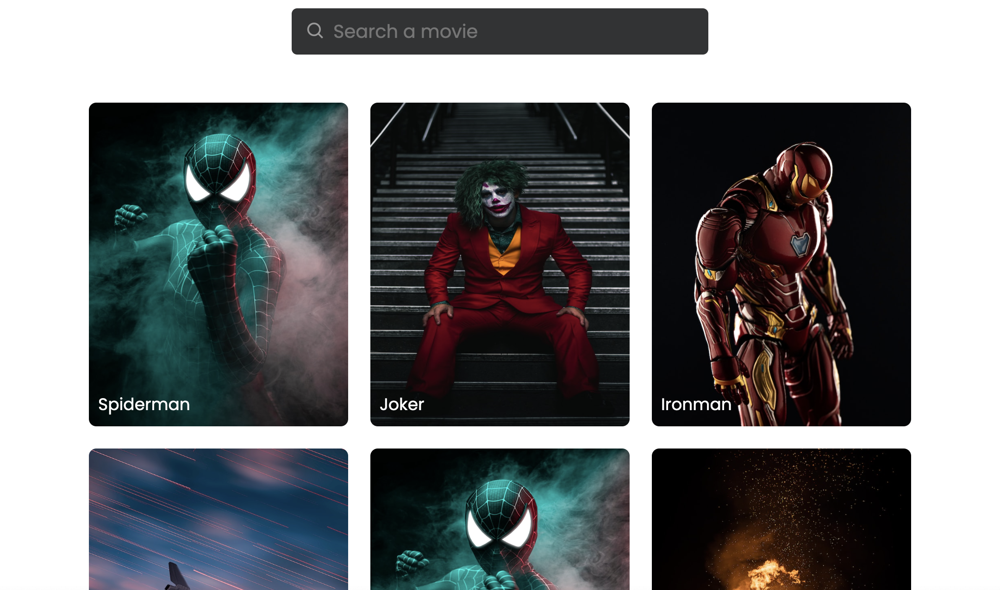

# Image gallery

> A simple website allows the user to search for movies.

## Table of contents

-   [General info](#general-info)
-   [Screenshots](#screenshots)
-   [Technologies](#technologies)
-   [Setup](#setup)
-   [Features](#features)
-   [Status](#status)
-   [Inspiration](#inspiration)
-   [Contact](#contact)

## General info

> The objective of the project is to practice separation of concern in JavaScript.

## Screenshots



## Technologies

-   JavaScript
-   HTML5
-   CSS3
-   VSC code

## Setup

clone the repo and start using the stop watch.

## Code Examples

```js
import { data, dom } from '../data.js';
import createImage from '../components/createImage.js';

const loadHandler = () => {
    data.images.forEach((imgData) => {
        const id = imgData.id;
        const imgExist = dom.imgsDom.filter((imgDom) => imgDom.id === id)[0];
        if (!imgExist) {
            const imageDom = createImage(imgData);
            dom.imgsDom.push({
                id: id,
                title: imgData.title,
                dataName: imgData.dataName,
                dom: imageDom,
            });

            dom.images.append(imageDom);
        }
    });
};

export default loadHandler;
```

## Features

List of features ready and Todos for future development

-
-
-

To-do list:

-
-

## Status

Project is: _in progress_

## Inspiration

[codingNepal](https://www.codingnepalweb.com/image-gallery-search-box-html-css-javascript/)
